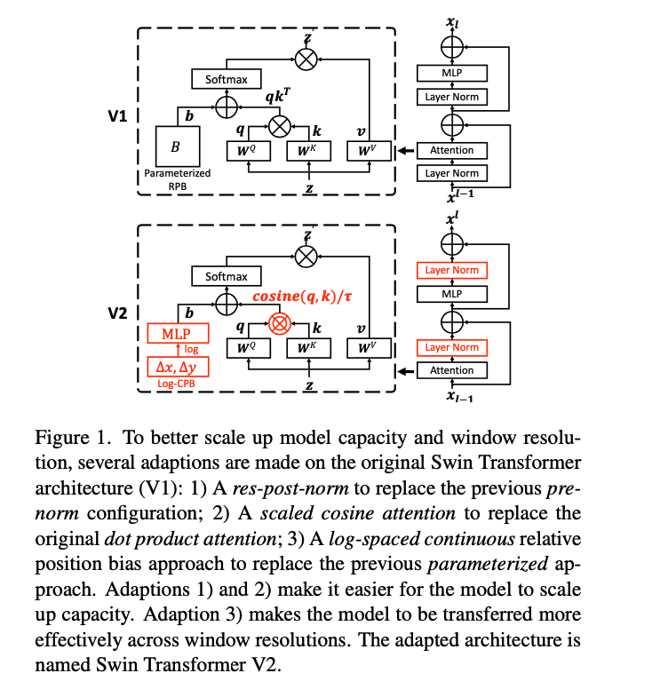
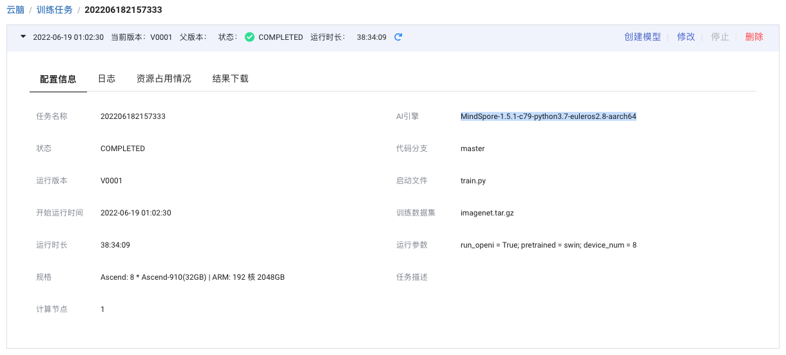
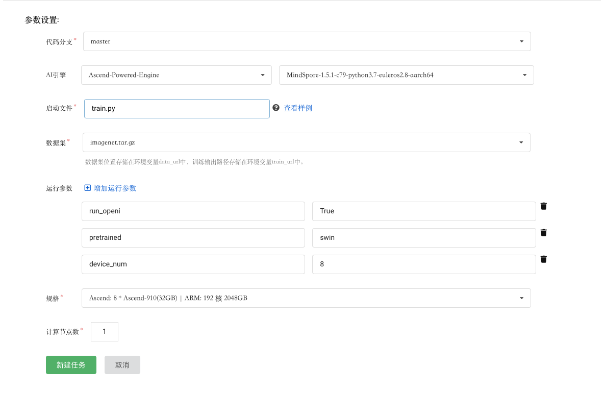
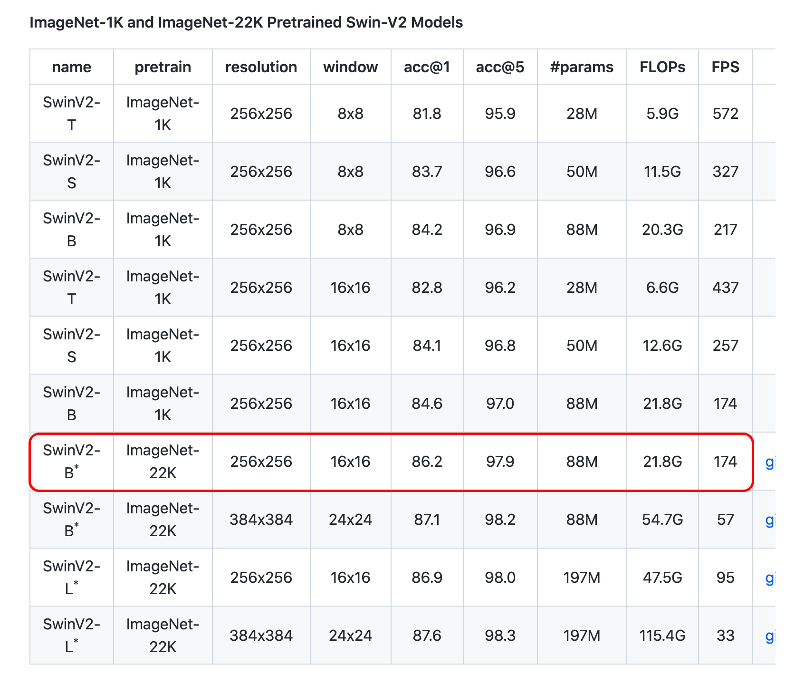
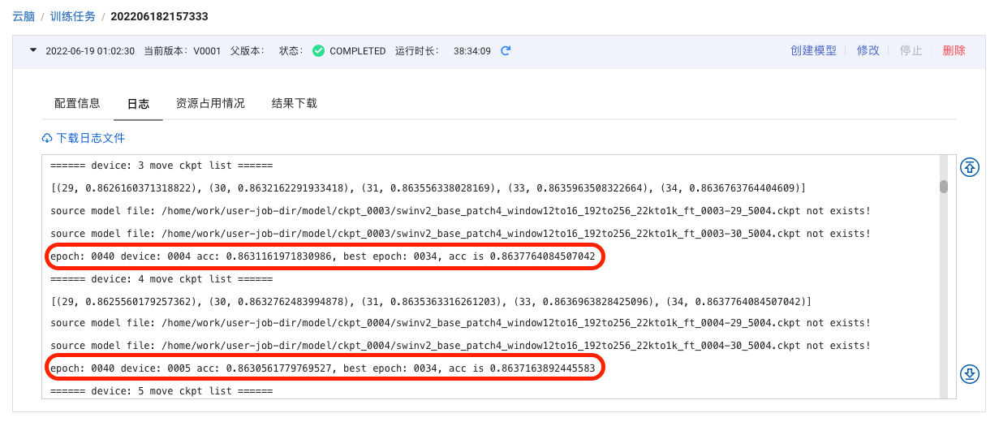

# SwinTransformerV2 模型自验报告

> 邢朝龙 kaierlong@126.com


## 1. 模型简介

### 1.1 网络模型结构简介

 


`Swin Transformer V2`是微软团队在`Swin Transformer（V1）`基础上提出的升级版网络结构。

在现有的视觉大模型中，主要存在几方面问题：

1. 增大视觉模型时可能带来很大的训练不稳定性
2. 对于需要高分辨率的下游任务，并没有很好的探索出对低分辨率下训练好的模型迁移到更大scale模型上的方法
3. GPU内存占用太大

针对以上问题，`Swin Transformer V2`主要提出三个改进点：

1. post normalization：在self-attention layer和MLP block后进行layer normalization
2. scaled cosine attention approach：使用cosine相似度来计算token pair之间的关系
3. log-spaced continuous position bias：重新定义相对位置编码


### 1.2 数据集

> 所用数据集地址：https://git.openi.org.cn/kaierlong/imagenet2012_whole/datasets

使用训练及测试数据集如下：

```shell
使用的数据集：ImageNet2012

数据集大小：共1000个类、224*224彩色图像
训练集：共1,281,167张图像
测试集：共50,000张图像
数据格式：JPEG
注：数据在dataset.py中处理。
下载数据集，目录结构如下：
└─dataset
   ├─train                 # 训练数据集
   └─val                   # 评估数据集
```


### 1.3 代码提交地址

暂时提交在启智中，私有未开源。

仓库地址如下：https://git.openi.org.cn/OpenZAI_ZERO/Swin-Transformer-V2


## 2. 代码目录结构说明

代码目录结构及说明如下：

```shell
.
├── README.md										// 说明文档
├── README_CN.md								// 中文说明文档
├── conv_pth2ckpt.py						// 预训练权重转换
├── eval.py											// 评估文件
├── image												// 文档图片目录
├── src
│   ├── args.py
│   ├── configs									// 模型参数配置目录
│   │   ├── parser.py
│   │   ├── swin_tiny_patch4_window7_224.yaml
│   │   ├── swinv2_base_patch4_window12to16_192to256_22kto1k_ft.ckpt  // 预训练权重文件
│   │   ├── swinv2_base_patch4_window12to16_192to256_22kto1k_ft.yaml
│   │   ├── swinv2_base_patch4_window8_256.yaml
│   │   ├── swinv2_large_patch4_window16_256.yaml
│   │   ├── swinv2_small_patch4_window8_256.yaml
│   │   └── swinv2_tiny_patch4_window8_256.yaml
│   ├── data										// 数据加载及处理目录
│   │   ├── __init__.py
│   │   ├── augment
│   │   │   ├── __init__.py
│   │   │   ├── auto_augment.py
│   │   │   ├── custom_transforms.py
│   │   │   ├── mixup.py
│   │   │   └── random_erasing.py
│   │   ├── data_utils
│   │   │   ├── __init__.py
│   │   │   └── moxing_adapter.py
│   │   └── imagenet.py
│   ├── image22kto1k.txt				// 22K转1K数据集ID映射表
│   ├── models									// 模型定义目录
│   │   ├── __init__.py
│   │   └── swintransformer
│   │       ├── __init__.py
│   │       ├── clip_ops.py
│   │       ├── get_swin.py
│   │       ├── get_swin_v2.py
│   │       ├── misc.py
│   │       ├── swin_transformer.py
│   │       └── swin_transformer_v2.py		// swin transformer v2定义文件
│   ├── tools										// 相关工具目录
│   │   ├── __init__.py
│   │   ├── callback.py
│   │   ├── cell.py
│   │   ├── criterion.py
│   │   ├── get_misc.py
│   │   ├── optimizer.py
│   │   └── schedulers.py
│   └── trainers							// 训练目录
│       ├── __init__.py
│       ├── model_ema.py
│       ├── train_one_step_with_ema.py
│       └── train_one_step_with_scale_and_clip_global_norm.py
└── train.py						// 训练文件
```


## 3. 自验结果（交付精度规格时需要补齐）

### 3.1 自验环境

软硬件环境如下：

- 启智AI引擎：MindSpore-1.5.1-c79-python3.7-euleros2.8-aarch64
- Ascend: 8 * Ascend-910(32GB) | ARM: 192 核 2048GB


**详细环境配置参见下图：**




### 3.2 训练超参数

超参数配置如下：

> 其中data_url由启智平台实际数据地址替换，训练时替换。

```yaml
# Architecture
arch: swinv2_base_patch4_window12to16_192to256_22kto1k_ft

# ===== Dataset ===== #
data_url: ./data/imagenet
set: ImageNet
num_classes: 1000
mix_up: 0.8
cutmix: 1.0
auto_augment: rand-m9-mstd0.5-inc1
interpolation: bicubic
re_prob: 0.25
re_mode: pixel
re_count: 1
mixup_prob: 1.
switch_prob: 0.5
mixup_mode: batch
crop_ratio: 0.875


# ===== Learning Rate Policy ======== #
optimizer: adamw
lr_scheduler: cosine_lr
base_lr: 0.00005
min_lr: 0.0000002
warmup_length: 5
warmup_lr: 0.00000002
cool_length: 10
cool_lr: 0.0000002
nonlinearity: GELU


# ===== Network training config ===== #
amp_level: O1
keep_bn_fp32: True
beta: [ 0.9, 0.999 ]
is_dynamic_loss_scale: True
use_global_norm: True
clip_global_norm_value: 5.
enable_ema: False
ema_decay: 0.9999
loss_scale: 1024
weight_decay: 0.00000001
momentum: 0.9
label_smoothing: 0.1
epochs: 40
batch_size: 32


# ===== Hardware setup ===== #
num_parallel_workers: 32
device_target: Ascend

# ===== Model config ===== #
drop_path_rate: 0.2
embed_dim: 128
depths: [ 2, 2, 18, 2 ]
num_heads: [ 4, 8, 16, 32 ]
window_size: 16
image_size: 256
pretrained_window_sizes: [ 12, 12, 12, 6 ]
```


### 3.3 训练

> 说明：
>
> 因为需要用到预训练模型，需要将pytorch模型进行转换，转换命令如下：
>
> 提前下载pytorch模型：
>
> - github地址：https://github.com/SwinTransformer/storage/releases/download/v2.0.0/swinv2_base_patch4_window12_192_22k.pth
> - 百度网盘：https://pan.baidu.com/s/1Xc2rsSsRQz_sy5mjgfxrMQ?pwd=swin
>
> ```shell
> # 友情提示需要用到pytorch环境
> python3 conv_pth2ckpt.py --pth_file=swinv2_base_patch4_window12_192_22k.pth --ckpt_file=src/configs/swinv2_base_patch4_window12to16_192to256_22kto1k_ft.ckpt
> src/configs/swinv2_base_patch4_window12to16_192to256_22kto1k_ft.ckpt --cls_map_file=src/image22kto1k.txt
> ```

### 3.3.1 如何启动训练脚本

训练如何启动：

- 启智平台

模型训练在启智平台完成，完整训练配置如下图所示：



- 本地命令

**如果需要本地训练，可以使用如下命令：**

```shell
python3 train.py --run_openi=True --arch=swinv2_base_patch4_window12to16_192to256_22kto1k_ft --pretrained=swin --device_num=8
```


#### 3.3.2 训练精度结果

- 论文精度如下:



- 复现精度如下：

  - 30 epochs

    

  - 40 epochs

    


- 精度结果对比
  - 论文精度为：86.2
- 复现精度为：
  - 86.32 （30 epochs，同论文一致）
  - 86.37 （40 epochs，自己增加了10个cooldown epochs）

- 结论：可以看出即便跟论文一致时，依然已经超过了论文中`86.2`的精度。


### 3.4 模型推理

推理命令如下：

```shell
python3 eval.py --config=src/configs/swinv2_base_patch4_window12to16_192to256_22kto1k_ft.yaml --pretrained={ckpt_path} --device_id={device_id} --device_target={device_target} --data_url={data_url}
```


## 4. 参考资料

### 4.1 参考论文

- [[2111.09883\] Swin Transformer V2: Scaling Up Capacity and Resolution (arxiv.org)](https://arxiv.org/abs/2111.09883)


### 4.2 参考git项目

- [microsoft/Swin-Transformer: This is an official implementation for "Swin Transformer: Hierarchical Vision Transformer using Shifted Windows". (github.com)](https://github.com/microsoft/Swin-Transformer)


### 4.3 参考文献

- [【简读】Swin Transformer V2: Scaling Up Capacity and Resolution - 知乎 (zhihu.com)](https://zhuanlan.zhihu.com/p/435210138)


